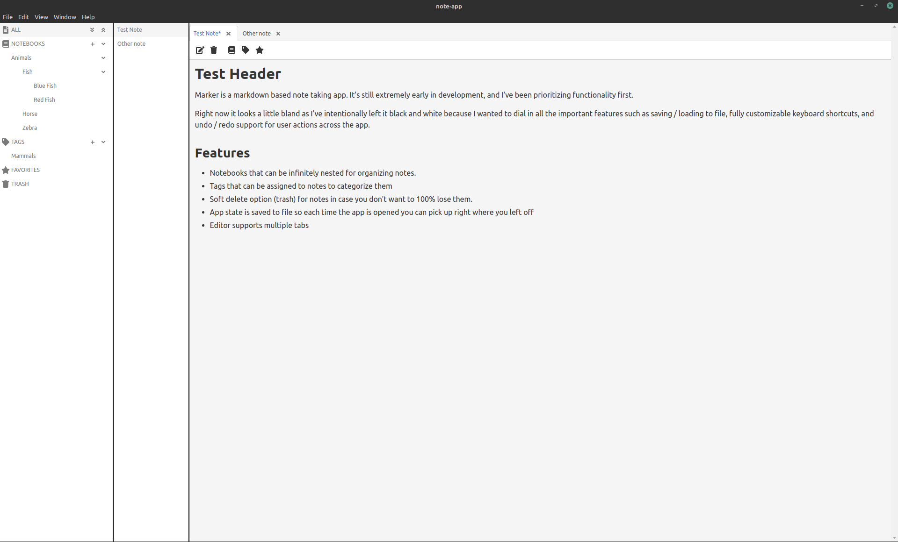

# Marker

Marker is a minimalistic markdown based note taking app. It's heavily inspired from Notable, and Joplin Notes. Marker is designed to remember exactly where you last left off so you never lose your place, and stores all of it's data in non-proprietary file formats.

The app itself is currently under double secret ~~probation~~ alpha development and not yet ready for use. The current roadmap estimates version 1.0.0 will be ready by August.



## Tech Stack

The app itself is running on Electron and is written in Vue 3. It uses TypeScript for compile time type safety to help prevent errors, and Vuex is used for state management. Markdown rendering is done thanks to Marked, and Bulma is used for styling.

The code itself is kept lean as possible and the domain logic is kept agnostic of any data persistence thanks to a custom Vuex plugin. Testing is done with Jest. The project doesn't have full test coverage (and won't for awhile) but all of the state management logic (Vuex) and what not has good coverage to help prevent any regressions.

Things that interact or modify the DOM in anyway don't have much (if any) tests right now because the look of the app will likely change over the next month or so. Components won't have tests until the app supports custom CSS themes.

## Project setup

```
npm install
```

### Compiles and hot-reloads for development

```
npm run serve
```

### Compiles and minifies for production

```
npm run build
```

### Run your unit tests

```
npm run test:unit
```

### Lints and fixes files

```
npm run lint
```

### Customize configuration

See [Configuration Reference](https://cli.vuejs.org/config/).
